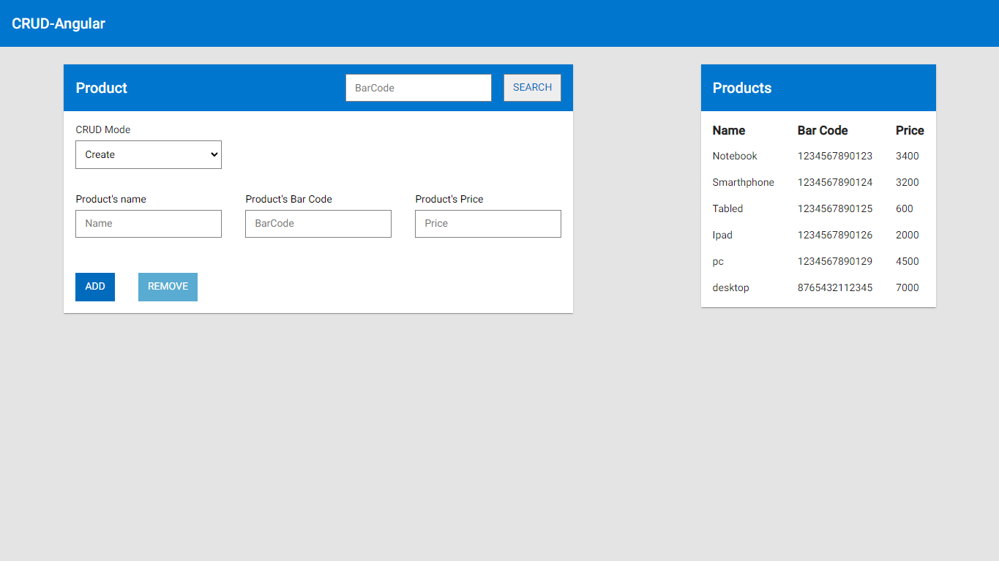

    
  
   # CRUD - Spring + Angular [front-end]
  

## 📑 Índice
- [Sobre o Projeto](#-sobre-o-projeto)
- [Tecnologias utilizadas](#-tecnologias-utilizadas)
- [Licença](#-licença)
  

## 💡 Sobre o Projeto

Este site foi pensado durante o *Lead Mentoring*, projeto da [LeadDell](https://leadfortaleza.com.br/portal), como forma de praticar os conceitos de Spring Boot, Angular, JPA e TypeScript. Seu objetivo é impletar um CRUD simples para produtos utilizando todas as tecnologias citadas.
Neste reposítorio está o front-end do projeto, uma página criada em Angular que consome uma API feita com SpringBoot. Além disso, esta aplicação utiliza componentes básicos do [Angular Material](https://material.angular.io/) e estilos do [Dell Design System](https://www.delldesignsystem.com/)
  
## 🚀 Tecnologias utilizadas

O projeto foi desenvolvido utilizando as seguintes tecnologias:

- HTML 5
- CSS3
- TypeScript
- Angular
   

## 📕 Licença

Todos os arquivos incluídos aqui, incluindo este _README_, estão sob [Licença MIT](./LICENSE). 
Criado por [Victor Martins](https://github.com/VictorM-Coder)

